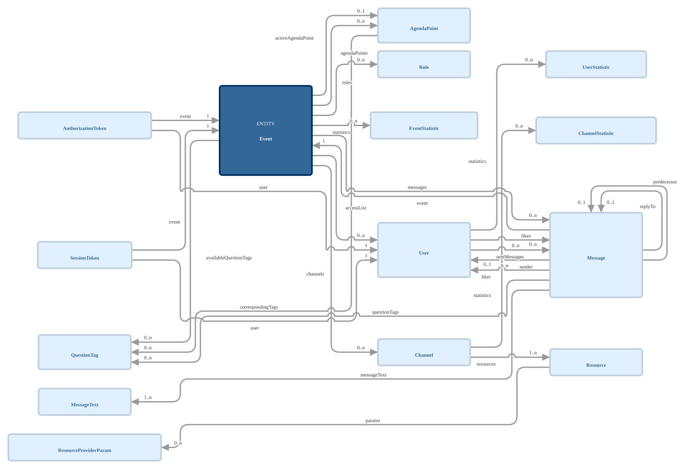
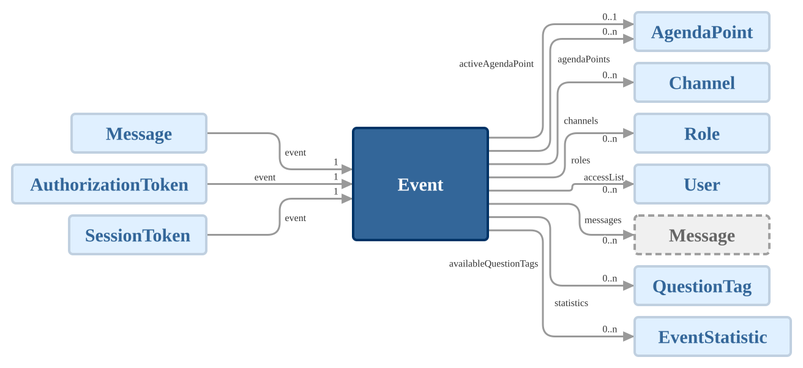
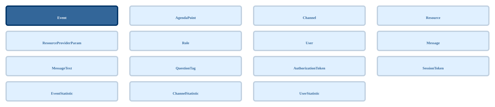
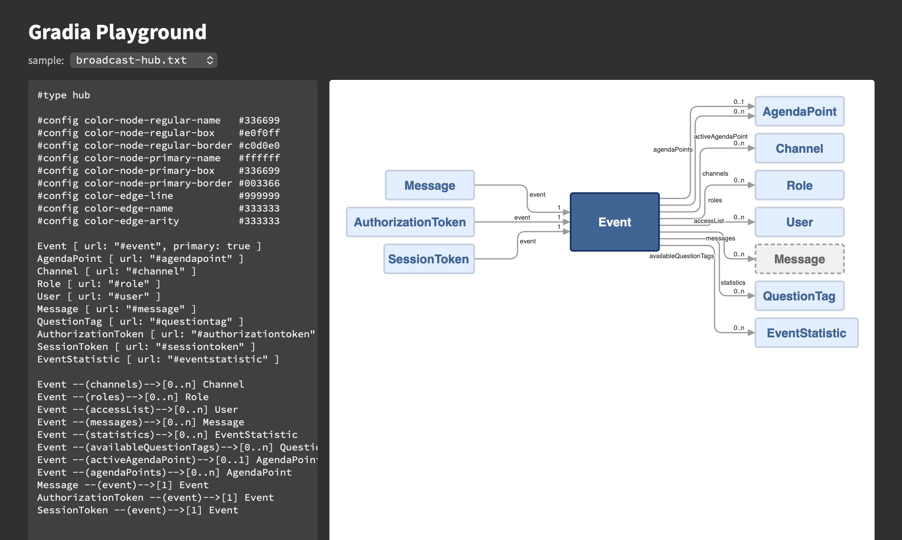

Gradia
======

**Object Graph Diagram Rendering**

<p/>


[](https://github.com/rse)
[](https://github.com/rse)

About
-----

**Gradia** is a small API and CLI for rendering directed graphs,
described in a concise textual input language, as SVG diagrams. Three
diagram types are supported which fit the scenario of visualizing object
graphs:

- `graph`: a loosely grid-snapped layered layout of the whole graph,
  based on the Dagre algorithm of [@antv/layout](https://github.com/antvis/layout).
- `hub`: a hub graph, placing one primary hub node between its input and
  output nodes.
- `grid`: a compact grid of tiles for an edge-less graph.

Examples
--------

Here are examples of the three graph diagram renderings:

- [broadcast-graph](smp/broadcast-graph.txt):

  

- [broadcast-hub](smp/broadcast-hub.txt):

  

- [broadcast-grid](smp/broadcast-grid.txt):

  

Playground
----------

See [playground.html](smp/playground.html) for a demo playground.



Installation
------------

```sh
$ npm install @rse/gradia
```

Usage
-----

```sh
$ gradia [-t graph|hub|grid] [-f <format>] [-c <name>=<value>] -o <file>.svg <graph>.txt
```

The diagram type is selected with the `-t` command-line option or, when
this is absent, by the `#type` directive inside the input, and defaults
to `graph`.

The output format is `svg:standalone` (a standalone SVG/XML document,
the default), `svg:embedded` (the SVG without the `<?xml?>` declaration,
for direct embedding into HTML), `url:xml` (a `data:image/svg+xml` URL
with URL-encoded XML), or `url:base64` (a `data:image/svg+xml` URL with
Base64-encoded XML).

MCP Service
-----------

```sh
$ gradia --mcp [-t graph|hub|grid] [-f <format>] [-c <name>=<value>]
```

With the `-m`/`--mcp` option, **Gradia** instead runs as a [Model Context
Protocol](https://modelcontextprotocol.io/) (MCP) service on stdio,
exposing a single tool `gradia_render` which renders a graph description
into an SVG diagram. The tool takes the arguments `input` (the graph
description), `type`, `format`, and `config` (an object of rendering
options), and returns the rendered SVG document or data URL as its text
result. Its description carries the entire input language grammar, so
an AI agent can author graph descriptions without further context. The
command-line options `--type`, `--format`, and `--config` act as the
defaults underlying the tool call arguments.

As the tool call arguments are treated as untrusted, the `config`
argument rejects the option `font-embed` and a `font-family` value
pointing to a WOFF2 file. Both remain available through the
(trusted) command-line options of the service.

Configure the service in an MCP client with:

```json
{
    "mcpServers": {
        "gradia": {
            "command": "npx",
            "args": [ "-y", "@rse/gradia", "--mcp" ]
        }
    }
}
```

Input Syntax
------------

The input is a plain-text graph description: one node/edge chain per
line, plus optional comments and rendering directives.

### Grammar

The following BNF grammar describes the input syntax. Non-terminals are
written as `<name>`, terminals as `"..."`, optional parts as `[ ... ]`,
repeatable parts as `{ ... }` (zero or more times), and alternatives are
separated by `|`.

```bnf
<graph>          ::= { <statement> | <newline> }
<statement>      ::= <node> { <edge> <node> } ( <newline> | <eof> )
<node>           ::= <atom> [ ":" <atom> ] [ <attributes> ]
<attributes>     ::= "[" <attribute> { "," <attribute> } "]"
<attribute>      ::= <atom> ":" <atom>
<edge>           ::= "--" [ "(" <edge-name> ")" "--" ] ">" [ "[" <edge-arity> "]" ]
<edge-name>      ::= <string> | <name-word>
<edge-arity>     ::= <string> | <arity-word>
<atom>           ::= <bareword> | <string>
<bareword>       ::= <bareword-char> { <bareword-char> }
<bareword-char>  ::= <char> - ( <whitespace> | "[" | "]" | "(" | ")" | "," | ":" | "\"" | ">" | "#" )
<name-word>      ::= <name-char> { <name-char> }
<name-char>      ::= <char> - ( <whitespace> | "(" | ")" | "\"" )
<arity-word>     ::= <arity-char> { <arity-char> }
<arity-char>     ::= <char> - ( <whitespace> | "[" | "]" | "\"" )
<string>         ::= "\"" { <string-char> } "\""
<string-char>    ::= ( <char> - ( "\"" | "\\" | <newline> ) ) | ( "\\" ( <char> - <newline> ) )
<comment>        ::= "#" { <char> - <newline> }
<directive>      ::= "#config" <whitespace> { <whitespace> } <option> <whitespace> { <whitespace> } ( <string> | <word> )
                   | "#type" <whitespace> { <whitespace> } <type>
<option>         ::= <letter> { <letter> | <digit> | "-" }
<type>           ::= "graph" | "hub" | "grid"
<word>           ::= <char> - <whitespace> { <char> - <whitespace> }
<newline>        ::= "\n"
<whitespace>     ::= " " | "\t" | "\r"
```

### Lexical Rules

- A `<bareword>` must not contain the character sequence `--` at any
  position, as `--` always starts an edge operator.

- An `<edge>` is a single lexical token: no whitespace and no comment is
  allowed anywhere inside it, especially not between `>` and `[`.

- Whitespace (except `<newline>`) is insignificant between all other
  tokens and never part of a token.

- A `<newline>` terminates a `<statement>`: statements cannot span
  multiple lines.

- A `<comment>` starts at an unquoted `#` and extends to the end of the
  line. Inside a `<string>`, `#` is an ordinary character.

- A `<string>` cannot span lines. Inside it, `\` escapes the following
  character (especially `\"` and `\\`).

- A `<directive>` is a `<comment>` which occupies its entire line and
  starts with the keyword `#config` or `#type`. For `#config`, the
  `<option>` has to be one of the recognized rendering options (see
  below). All other comments are ignored.

### Semantic Rules

- In `<node>`, the first `<atom>` is the node id and the optional
  `<atom>` after `:` is the displayed node label. Without a label, the
  id is displayed.

- A node can be referenced multiple times. All references address the
  same node and merge their label and attributes into it, with later
  values overriding earlier ones for the same attribute key.

- Nodes which are never part of an `<edge>` are rendered free-standing.

- In a chain `a --> b --> c`, each `<edge>` connects its immediately
  preceding and following node, i.e., the chain is equivalent to the
  two statements `a --> b` and `b --> c`.

- The `<edge-name>` is rendered as the label of the edge and the
  `<edge-arity>` as its cardinality label.

- Four attribute keys are reserved and consumed by the renderer instead
  of being displayed as a regular `<key>: <val>` line:

    - `url: <url>` renders the node box as a hyperlink. Only relative URLs
      and the schemes `http`, `https`, and `mailto` are honored; any other
      URL is silently dropped and the node box then simply stays unlinked,
    - `type: <name>` renders `<name>` as a smaller text above the node
      label inside the node box,
    - `primary: true` renders the node in the primary node colors
      (and, for diagram type `hub`, marks the single central hub node),
    - `group: <name>` places the node into the surrounding group box
      `<name>`.

- A node cannot be a member of more than one group. As soon as at least
  one node carries a `group` attribute, all nodes without one implicitly
  belong to the group `default`, and every edge has to stay within a
  single group.

- All remaining attributes are displayed as `<key>: <val>` lines inside
  the node box.

### Diagram Type Constraints

The diagram type `graph` imposes no constraints on the topology: it
accepts self-loops and free-standing nodes alike, and hence is the safe
choice whenever the topology is not known to fit `hub` or `grid`.

The diagram type `hub` rejects the input with an error unless all of the
following conditions hold:

- Exactly one node carries the attribute `primary: true`.

- Every edge either points to or originates from that primary node. An
  edge between two non-primary nodes is rejected.

- The primary node carries no self-loop.

- Every non-primary node is an input or an output of the primary node,
  i.e., no node is free-standing.

A node which is both an input and an output of the primary node is placed
twice, once in the input column and once in the output column. The second
placement is rendered as a dashed "ghost" box, colored by the
`color-node-ghost-*` options.

The diagram type `grid` rejects the input with an error as soon as the
graph contains at least one edge.

As the groups of a grouped graph are laid out individually with the
selected diagram type, these constraints apply to every single group. For
the type `hub` this especially means that every group needs its own
primary node.

### Directives

A `#type` directive sets the diagram type (`graph`, `hub`, or `grid`),
which otherwise is settable through the `-t`/`--type` command-line
option (which takes precedence). The last occurrence wins and an invalid
type is silently ignored. Without both, the type defaults to `graph`.

A `#config` directive sets one of the rendering options, which otherwise
are settable through the corresponding `--config <option>=<value>`
command-line options (`font-embed` being command-line only, see below).
The recognized options are:

```
font-family                  color-edge-name             graph-channel-width-min
font-embed                   color-edge-arity            graph-gutter-height-max
color-node-regular-name      color-edge-halo             graph-gutter-height-min
color-node-regular-box       size-canvas-margin          graph-node-separation
color-node-regular-border    size-node-width-min         graph-rank-separation
color-node-primary-name      size-node-width-max         graph-node-degree-max
color-node-primary-box       size-node-height-scale      hub-channel-width-max
color-node-primary-border    size-edge-corner-radius     hub-channel-width-min
color-node-ghost-name        size-edge-hop-radius        hub-node-gap
color-node-ghost-box         size-edge-track-gap         hub-node-degree-max
color-node-ghost-border      size-edge-port-gap          grid-columns-max
color-group-name             group-box-padding           grid-columns-min
color-group-box              group-box-gap               grid-gap-horizontal
color-group-border           graph-columns-max           grid-gap-vertical
color-edge-line              graph-channel-width-max     grid-node-width-equal
```

The `size-*`, `group-*`, `graph-*`, `hub-*`, and `grid-*` options
control the rendering geometry (canvas margin, node box sizing, edge
routing, group box spacing, and the per-diagram-type layout) and take
non-negative numbers, except the boolean `grid-node-width-equal`.

The `size-node-width-max` option additionally enables the word-wrapping
of the node box texts: given a positive value, the node name, its type,
and its attribute lines are greedily broken at whitespace so that the
node box stays within the given width and grows in height instead. The
default `0` disables the wrapping entirely and hence lets a node box
become as wide as its longest text. A single word wider than the
maximum is never broken and still widens the box beyond the maximum.

The `size-edge-port-gap` option (default `24`) controls the distance of
the edge attachment ports along a node side, and hence the vertical
distance of the parallel edges and their labels. It is a *maximum*: a
node box too small to hold all its ports at that distance packs them
closer together instead. A node side carrying more edges than
`graph-node-degree-max` respectively `hub-node-degree-max` grows its box
height by this very distance per additional edge.

The `graph-channel-width-*` and `graph-gutter-height-*` options control
the spacing of a `graph` diagram: its inter-column channels and
inter-row gutters are sized by the edges routed through them and by the
edge labels landing inside them -- a channel by the widest label demand
it has to hold (an edge name placed along it, or an edge arity set back
from its arrow head), a gutter by one text line per edge name placed
along its run. The `-min` options (defaults `24` and `20`) raise the
result, so that even an unlabeled diagram can be spaced out, while the
`-max` options (defaults `140` and `90`) cap it, so that neither many
parallel edges nor a long label can push the nodes apart without bound.

The `grid-columns-min` and `grid-columns-max` options control the column
count of a `grid` diagram, which by default is derived from the node
count as a roughly square grid: `grid-columns-min` (default `3`) raises
the derived count, so that a few nodes still share a single row instead
of being stacked, while `grid-columns-max` (default `4`) caps it, so
that larger diagrams grow in height only. The column count never
exceeds the node count and the maximum always wins over the minimum.

The `grid-node-width-equal` option controls the tile widths of a `grid`
diagram: its default `true` forces all node boxes to the width of the
widest one and hence yields a strictly regular grid, while `false` lets
each column become only as wide as its own widest node box.

The `font-family` and `color-*` options are embedded directly into the
generated SVG. When such an option is *not* explicitly configured, the
SVG references the CSS custom property `--gradia-<option>` (definable by
the embedding document, e.g. for the `svg:embedded` output format) and
falls back to the built-in default. An explicitly configured value is
hard-coded into the SVG instead. The resulting precedence is: first
`#config`/`--config`, then the CSS custom property `--gradia-<option>`,
and finally the built-in default.

The `font-family` option is either a built-in font family, a plain font
family name, or the path to a WOFF2 file. The only built-in font family
is `Source Sans 3`, shipped as a variable WOFF2 file by the NPM
dependency [source-sans](https://github.com/adobe-fonts/source-sans),
and hence the only font which can be embedded without an external font
file:

```sh
$ gradia -c font-family="Source Sans 3" -c font-embed=true -o graph.svg graph.txt
```

The option `font-embed`, and a `font-family` value pointing to a WOFF2
file, are intentionally rejected in directives, as the input is treated
as untrusted. Both are available on the command-line only.

### Example

```
#type   graph

#config color-node-primary-box  #336699
#config color-edge-line         #999999

Animal: animal [ type: "abstract class", kind: base, url: "#animal", primary: true ]
Dog: dog
Cat: cat

Dog --(isa)--> Animal
Cat --(isa)--> Animal
"Pet Owner" --(owns)-->[0..*] Dog --(chases)-->[0..n] Cat
```

License
-------

Copyright &copy; 2026 Dr. Ralf S. Engelschall (http://engelschall.com/)<br/>
Distributed under MIT license (https://spdx.org/licenses/MIT.html)

